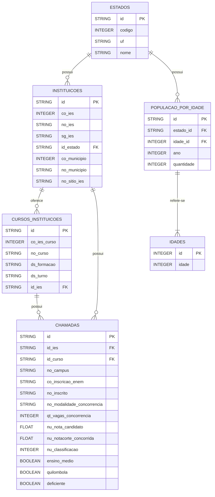

```mermaid
erDiagram
    ESTADOS ||--o{ INSTITUICOES : possui
    ESTADOS ||--o{ POPULACAO_POR_IDADE : possui
    ESTADOS {
        STRING id PK
        INTEGER codigo
        STRING uf
        STRING nome
    }

    INSTITUICOES ||--o{ CURSOS_INSTITUICOES : oferece
    INSTITUICOES ||--o{ CHAMADAS : possui
    INSTITUICOES {
        STRING id PK
        INTEGER co_ies
        STRING no_ies
        STRING sg_ies
        STRING id_estado FK
        INTEGER co_municipio
        STRING no_municipio
        STRING no_sitio_ies
    }

    CURSOS_INSTITUICOES ||--o{ CHAMADAS : possui
    CURSOS_INSTITUICOES {
        STRING id PK
        INTEGER co_ies_curso
        STRING no_curso
        STRING ds_formacao
        STRING ds_turno
        STRING id_ies FK
    }

    CHAMADAS {
        STRING id PK
        STRING id_ies FK
        STRING id_curso FK
        STRING no_campus
        STRING co_inscricao_enem
        STRING no_inscrito
        STRING no_modalidade_concorrencia
        INTEGER qt_vagas_concorrencia
        FLOAT nu_nota_candidato
        FLOAT nu_notacorte_concorrida
        INTEGER nu_classificacao
        BOOLEAN ensino_medio
        BOOLEAN quilombola
        BOOLEAN deficiente
    }

    POPULACAO_POR_IDADE ||--|{ IDADES : refere-se
    POPULACAO_POR_IDADE {
        STRING id PK
        STRING estado_id FK
        INTEGER idade_id FK
        INTEGER ano
        INTEGER quantidade
    }
    
    IDADES {
        INTEGER id PK
        INTEGER idade
    }

```